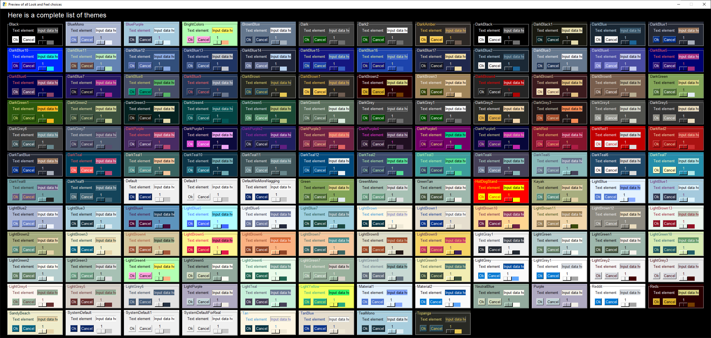
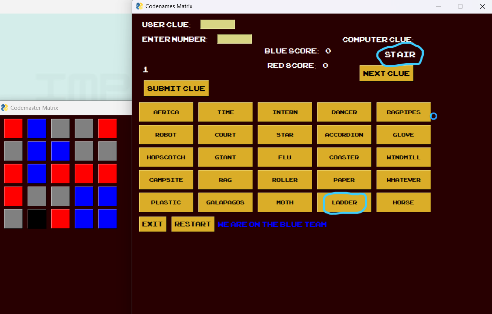

# Codenames
Hi, Welcome to my Codenames game :D

Codenames is a popular word-based board game. In this game, two teams compete to see who can correctly guess their words first. Each team has a spymaster who gives one-word clues to their team to help them guess their words. In my version of the game, you and the computer (AI) is on the same team (Blue team)

## How the game works

This implementation of Codenames is written in Python and uses several libraries such as PySimpleGUI, Pygame, and VLC. The game starts with a loading screen that plays a video using the VLC library. The game board is then displayed using PySimpleGUI, with a 5x5 grid of buttons representing the words. The game also includes sound effects using the Pygame library.

The game logic is implemented in several Python files. The `main.py` file contains the main game loop and calls functions from other files to handle events such as submitting a clue or clicking on a word button. The `loadingscreen.py` file contains the code for playing the loading screen video. The `game.py` file contains functions for handling game events such as changing the color of a button when it is clicked or ending the game when one team wins. The `ui.py` file contains functions for creating the game windows using PySimpleGUI. Finally, the `words.py` file contains functions for generating new words for the game and finding similar words to use as clues.

PysimpleGUI has multiple themes, everytime you run or restart the game, you'll get a different theme.

## How to play

To play the game, you can enter a clue in the "User Clue" input box and specify the number of words that the clue is associated with in the "Enter Number" input box. Then, click on the "Submit Clue" button and the computer will select words from the matrix based on your clue.

You can also click on the "Next Clue" button to have the computer give you a clue. The computer will generate a clue and display it on the screen, along with the number of words that the clue is associated with. You can then try to guess which words on the matrix are associated with the computer's clue.

To win the game, you need to guess all 8 blue words from the matrix. If you hit civilian words neither of the teams get any points and if you hit the assissn word, it's instant Game Over! and you lose.

## Requirements

To run this code, you will need to have Python installed on your computer along with the following libraries:
- PySimpleGUI
- Pygame
- VLC

You will also need to have the GloVe pre-trained word vectors saved in a file named `gloveupdated1.pkl` in the `Codenames` directory. (The Gloveupdated1.pkl file is too huge, if you would like to download it, here is the drive link for all requirements - https://drive.google.com/drive/folders/1igF4F6LUmjTB2V16SeoZdiwiXk3Ye8CH?usp=sharing)

## Challenges

One of the biggest challenges in developing this game was finding similar words to use as clues. Several pre-trained word vector models were tested, including Word2Vec, but the accuracy was not satisfactory. Eventually, GloVe was chosen because it reads through an entire corpus rather than individual documents, which resulted in better accuracy when finding similar words.
